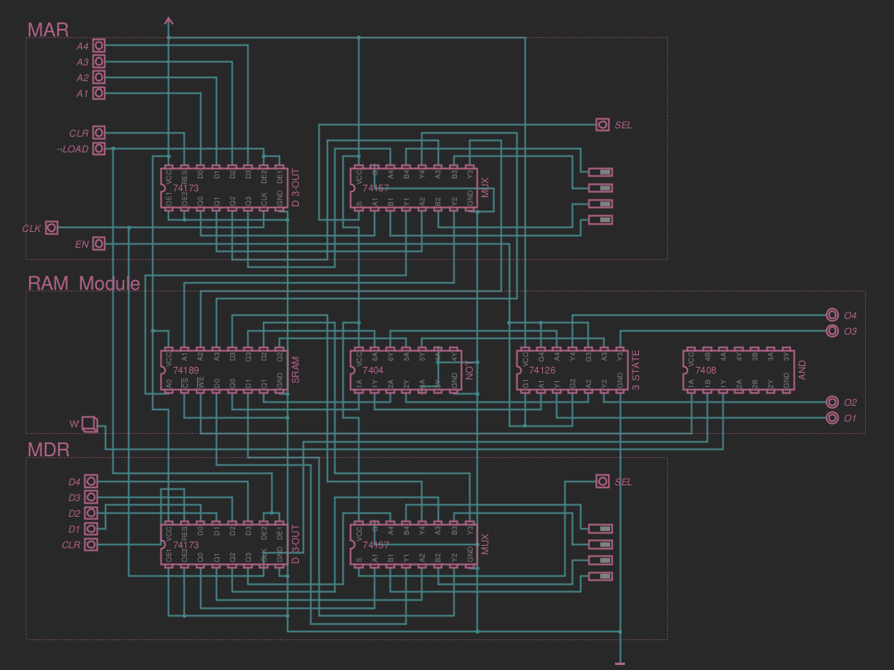
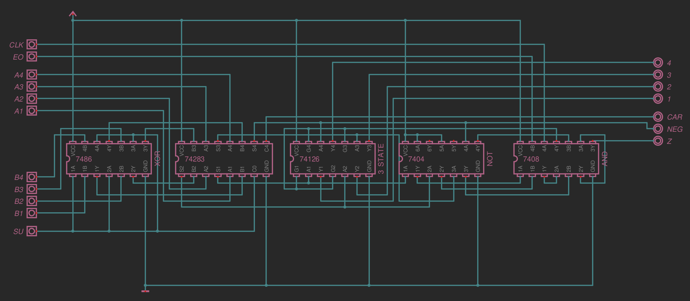
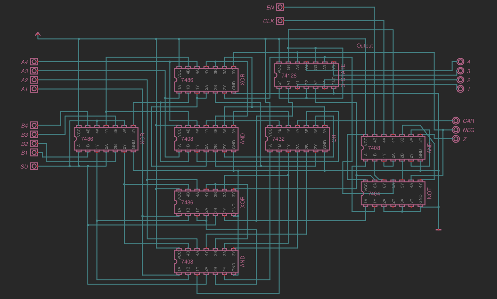
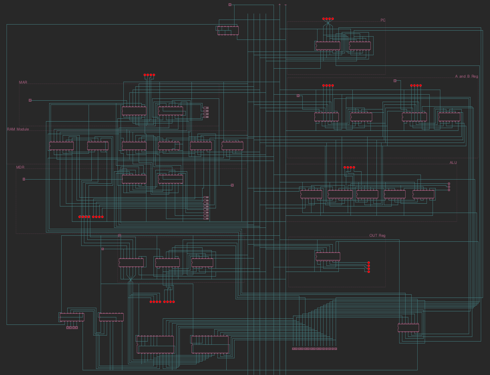

# 4-Bit-Homebrew_Comp
A Homebrew computer built mainly using only the fundamental logic gates. This is a 4-Bit computer using the SAP-1 architecture.

I am using the application Digital by hneemann ([link](https://github.com/hneemann/Digital)) to simulate the computer.

## Progress
Here are some screenshots of the progress:

- RAM Module, consisting of RAM, MAR and MDR:

- ALU Simple:

- ALU from just logic gates:

- Full Assembly using ICs:
    - Combining all the work together and put in into 1 file with the control unit. I replaced all the combinational logic with EEEPROMS instead which made it all very neat and easy to change.

 

