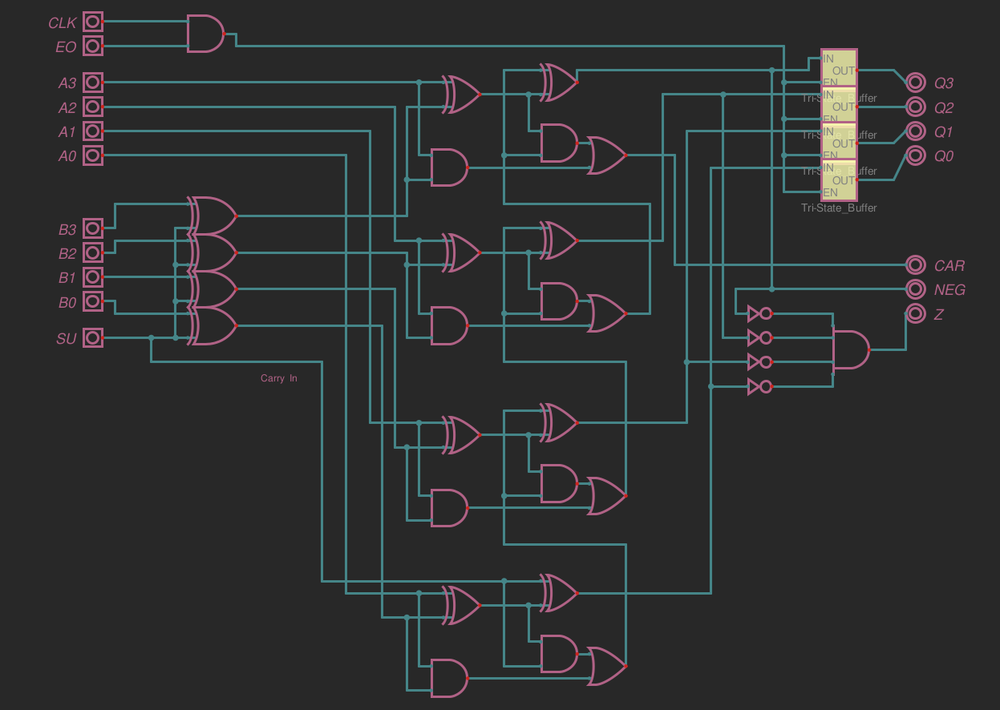
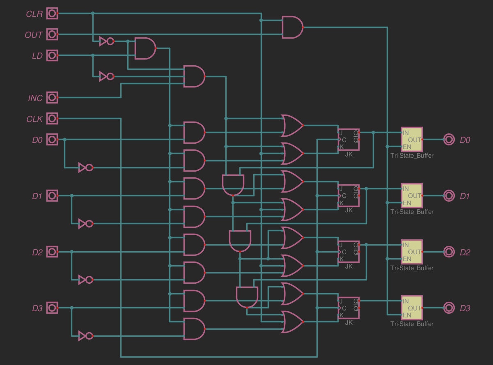
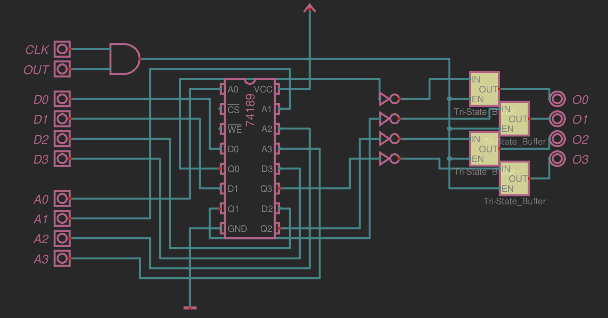
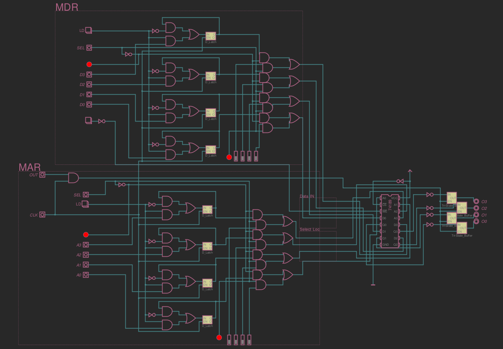
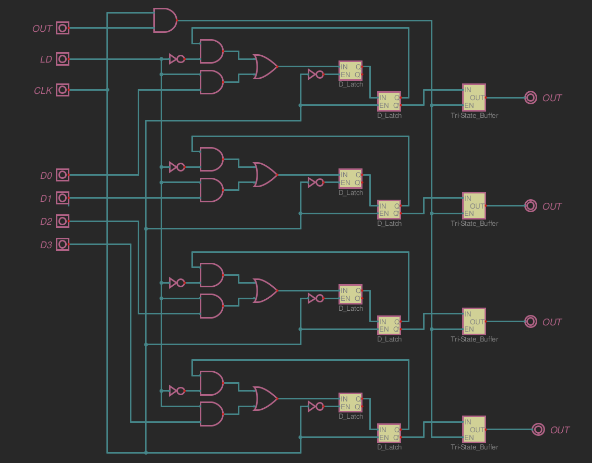
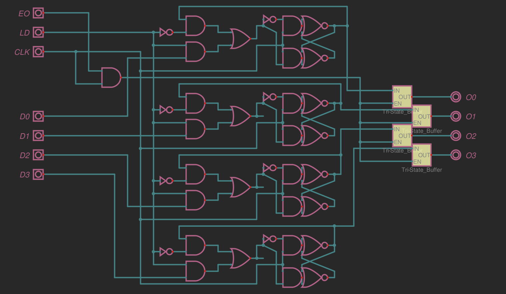
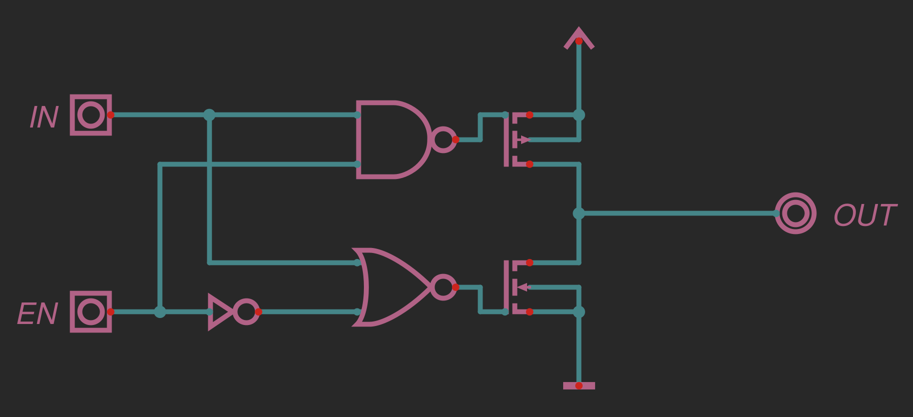

# Logic Gates 

There are pictures from the initial design using logic gates.

- ALU:

- Binary Counter/ Program Counter:

- RAM Module Iterations:

- Register Iterations:

- The essential Tri-State Buffer:

